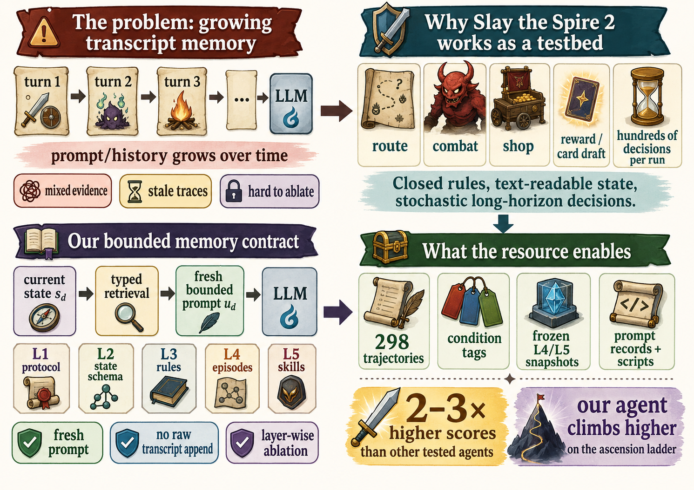
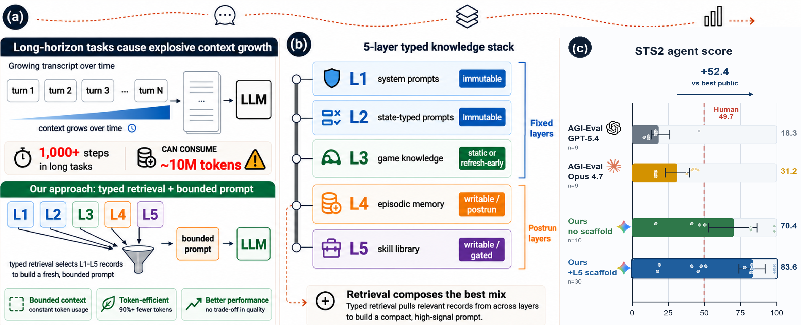
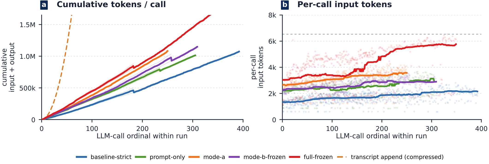
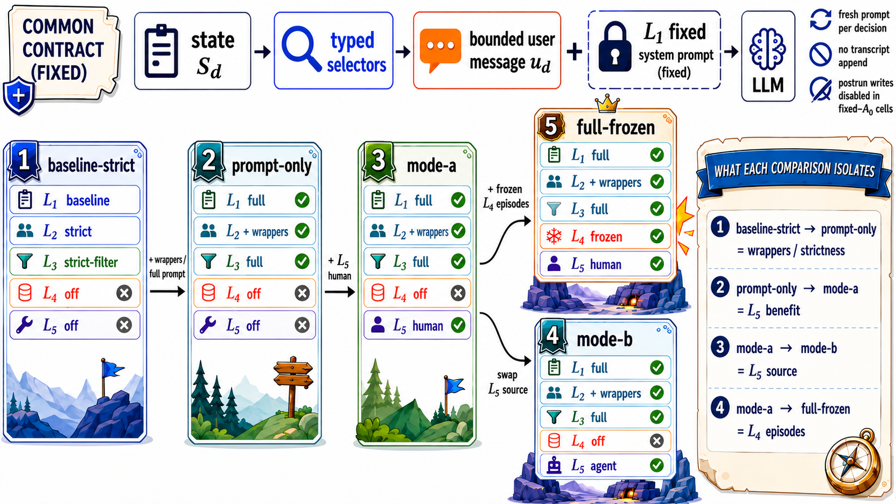
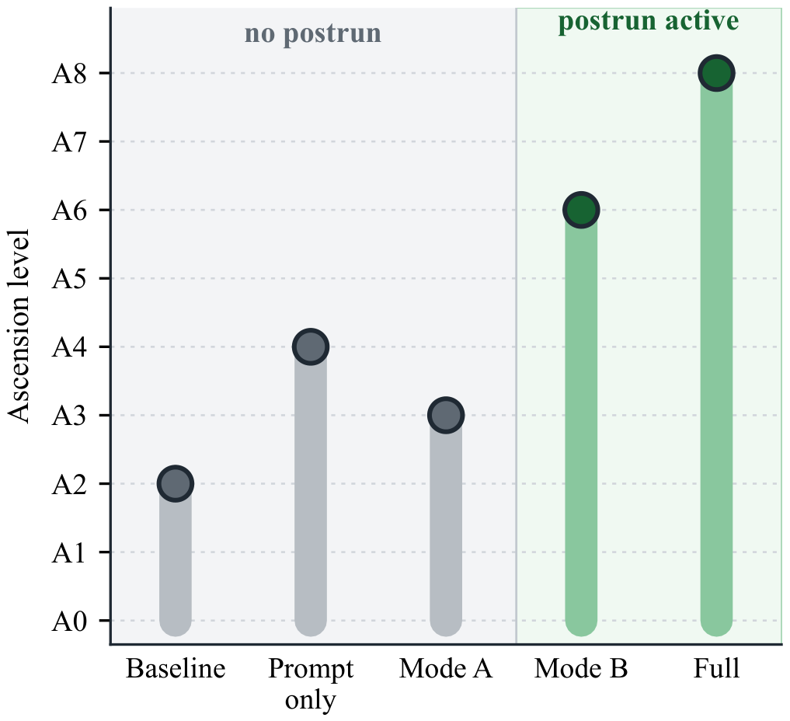
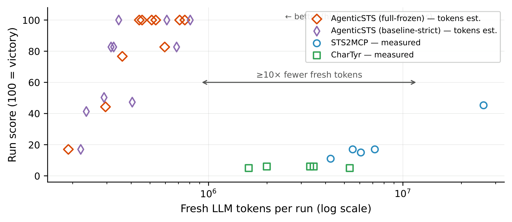

<div align="center">


# AgenticSTS

### A Bounded-Memory Testbed for Long-Horizon LLM Agents

**Memory for a long-horizon agent is a contract about what each future decision is allowed to see.<br/>AgenticSTS makes that contract bounded, typed, and ablatable — and releases a reproducible Silent-A0 benchmark where this design wins games that tested public transcript agents did not.**

[](AgenticSTS/LICENSE)
[](AgenticSTS-Mod/LICENSE)
[](AgenticSTS/pyproject.toml)
[](AgenticSTS-Mod/STS2AIAgent)
[](AgenticSTS-Data)
[](https://huggingface.co/datasets/ShandaAI/AgenticSTS-trajectories)

[](https://github.com/AlayaLab/AgenticSTS/stargazers)
[](https://github.com/AlayaLab/AgenticSTS/issues)
[](#%EF%B8%8F-configuration)



</div>

## ⚡ Overview

Most long-horizon LLM agents use the simplest memory contract: **append everything** — past observations, tool calls, reflections — to every prompt. Context grows without bound, stale traces re-enter decisions, and when the agent improves, *no one can say which memory component did it*.

**AgenticSTS** implements the opposite contract. Every decision is made from a **fresh user message assembled by typed retrieval** from five knowledge layers — no raw cross-decision transcript is ever appended. The prompt stays bounded across runs of any length, and **any single layer can be ablated in isolation**.

We instantiate this in ***Slay the Spire 2***, a closed-rule stochastic deck-building game whose runs demand hundreds of tactical and strategic decisions. The task is hard but unsaturated:

| | A0 win rate |
|---|---|
| Frontier LLMs (public AGI-Eval benchmark, 5 configs) | **0 wins** (max defeat floor 33) |
| Human players (developer-reported, 240M community runs) | **16%** |
| AgenticSTS — bounded contract, *no* learned stores | **3/10** |
| AgenticSTS — bounded contract **+ triggered skills (L5)** | **6/10** |

What the project offers:

1. **🧾 A bounded memory contract** — each decision prompt is composed as `u_d = π(L1, L2(s), L3(s), L4(s), L5(s))`; with capped top-k retrieval, prompt size is independent of run length (a transcript interface grows Ω(d·s̄)).

2. **🔬 An ablatable evaluation surface** — because context reaches the model through named slots, prompt strictness, rules, episodes, and skills can be switched on/off independently. In the 5-cell fixed-A0 matrix the **largest observed win-rate difference** coincides with enabling **L5 skills** (+2/10 at equal prompt setup); at N=10 this is directional, not statistically significant (Fisher exact p≈0.37).

3. **🛠️ Two skill-population routes** — *mistake-driven discovery* (combat-loss analysis → pre-write A/B gate → 4-level write gate) and *template-filled authoring* (Mode B). Mode B reaches the **same 6/10 point estimate** as the hand-authored seed library — compatibility at this sample size, not statistical equivalence — separating "having a skill layer" from "who wrote the prose".

4. **📈 Difficulty-ladder evidence** — in the released ladder, postrun-writable L4+L5 streams attempt ascension **A6–A8**; no-postrun streams stop at A2–A4 (an endpoint stream, separate from the fixed-A0 win-rate analysis).

5. **💸 Order-of-magnitude efficiency** — vs. the two open-source accumulating-context StS2 agents: ~**4× less wall-clock per floor** and **66–90× fewer fresh LLM tokens per score point** (≥7× even under an intentionally absurd upper bound). Their per-call prompt grows from ~9k toward ~500k tokens within a single run; the bounded contract's stays flat. The token comparison is honest-but-asymmetric — ours is an *estimate* (strategic calls × ~5k user-message tokens), competitors are *measured* fresh non-cached tokens, and part of the gap is decision batching (one strategic call drives several actions in our agent). Full accounting in §7 of the paper and [`RESULTS.md`](AgenticSTS/docs/experiments/competitor_comparison/RESULTS.md).

6. **📦 A reusable research artifact** — 298 condition-tagged trajectories, SHA-anchored frozen L4+L5 snapshots, decision-time prompt records, and Wilson/bootstrap analysis scripts, so the headline cells can be recomputed and re-sliced.

> The agent plays through an HTTP API exposed by a C# game mod (fork of [CharTyr/STS2-Agent](https://github.com/CharTyr/STS2-Agent)); the game is unmodified beyond state extraction and action injection.

## 🧠 The Bounded Memory Contract

<div align="center">

</div>

| Layer | Contents | Mutability | Experimental role |
|---|---|---|---|
| **L1** — operator prompts | Role + protocol templates per state type | Immutable | Fixed |
| **L2** — state-typed prompts | Schemas & legal action formats (combat, deck, map, event, …) | Immutable | Fixed / strictness toggle |
| **L3** — game knowledge | Cards, relics, events, enemies, intents (patch-refreshed) | Static | Filterable |
| **L4** — episodic memory | Postrun summaries (character × ascension × act × enemy) | Writable / postrun | On / off / frozen |
| **L5** — skill library | Triggered strategic guides with explicit trigger + prose policy | Writable / gated | On / off / frozen / source-swapped |

Raw game logs are **not** used as similarity RAG — in this game, near-identical-looking states can have opposite strategic meanings (card order, relic combos, route history). The agent retrieves *summaries and triggered guides*, not nearest-neighbor log snippets.

**Routing.** A dispatcher sends decisions to four model tiers — *fast* (trivial combat plays), *strategic* (ordinary decisions), *analysis* (postrun extraction), *evolution* (skill distillation). Four static system prompts are cacheable; all per-run state lives in the user message. Combat keeps at most 3 messages per round; earlier rounds are summarized through typed state. Result: a **median of 67 strategic LLM calls per run** instead of one call per in-game action.

<div align="center">


*Token audit on ten fixed-A0 runs: per-call prompt size stays flat; the dashed line is a transcript-appending counterfactual at ¼ of naive O(c²) growth.*
</div>

## 📊 Results

### Fixed-A0 ablation — largest difference with the skill layer

<div align="center">

</div>

| Cell | L5 skills | L4 episodes | Wins | Mean score |
|---|:---:|:---:|:---:|:---:|
| `baseline-strict` (no scaffold) | — | — | 3/10 | 70.4 |
| `prompt-only` | — | — | 4/10 | 69.6 |
| `mode-a` (hand-authored skills) | ✅ A | — | **6/10** | **85.5** |
| `mode-b-frozen` (template-filled skills) | ✅ B | — | **6/10** | 83.3 |
| `full-frozen` (skills + episodes) | ✅ A | ✅ | **6/10** | 82.1 |

N=10 per cell; Wilson 95% CIs [11,60] / [17,69] / [31,83] for 3/10 / 4/10 / 6/10. At equal prompt setup, Δ(prompt) = +1/10 while **Δ(L5) = +2/10** — the largest observed difference is with the skill layer. **At N=10 this is not statistically significant** (Fisher exact p≈0.37; pooled scaffolded-vs-not p≈0.148; CIs overlap): read it as directional. Whether the bounded contract itself beats a *matched* accumulating-context design is an open question left to a controlled follow-up (see paper §Limitations).

### Ascension ladder & cross-backbone probe

<div align="center">

</div>

Postrun-writable streams attempt **A6–A8**; no-postrun streams stop at A2–A4. The Gemini-trained L4+L5 stack is **backbone-sensitive** when applied to other backbones (an *empirical property, not a premise*; a diagnostic probe, not a controlled transfer study):

| Backbone | Wins | Score | Δ% |
|---|:---:|:---:|:---:|
| Qwen 3.6-27B | 0/5 → 0/5 | 14.6 → **26.9** | **+84.5** |
| DeepSeek V4-Pro | 0/5 → 0/5 | 41.3 → 33.8 | −18.1 |
| Gemini 3.1-Pro | 3/10 → **6/10** | 70.4 → **82.1** | +16.6 |

### Against accumulating-context agents — operational comparison, caveats disclosed

<div align="center">

</div>

Both open-source StS2 agents (STS2MCP, CharTyr) re-send a single growing chat transcript on every decision. On Silent-A0 runs with the same strategic model for all agents (`gemini-3.1-pro-preview`; our agent additionally routes trivial decisions to a flash-lite fast tier and sets explicit thinking effort, while competitors run at provider-default thinking — their intended setup): they win **0/5 each** (mean floors 17.6 / 5.6), need **~4×** the wall-clock per floor (9.9 / 8.5 vs **2.3** min — 96% of it provider-reported LLM latency), and spend **66–90×** more fresh (non-cached) tokens per score point. Our cells ran on game build v0.103.1; competitor runs on v0.103.3 (a 2026-05-30 minor patch landed between batches; our stack was re-verified on v0.103.3). CharTyr's 0/5 is partly an `invalid_action` interface bug — a property of the agent under test, faithfully reproduced, not a tuned baseline. All captured prompts/responses are released for audit; full token-accounting caveats (estimate-vs-measured, decision batching, ≥7× upper bound) are in [`RESULTS.md`](AgenticSTS/docs/experiments/competitor_comparison/RESULTS.md).

## 📦 Repository Layout

```
AgenticSTS (monorepo)
├── AgenticSTS/                 # 🧠 The agent (Python, Apache-2.0)
│   ├── src/
│   │   ├── agent/              #   Core loop: observe → retrieve → decide → act
│   │   ├── brain/              #   Decision engine, 4-tier model routing, prompts (L1/L2)
│   │   ├── knowledge/          #   L3 game knowledge (577 cards, 121 monsters, …)
│   │   ├── memory/             #   L4 episodic memory + retrieval
│   │   ├── skills/             #   L5 skill library, discovery, write gate
│   │   ├── mcp_client/         #   Async HTTP/SSE client for the mod API
│   │   └── ...                 #   state / monitor / runs / eval / patch
│   ├── frontend/               #   React monitor dashboard (:8081)
│   ├── scripts/                #   run_agent, run_ablation, inspect_memory, …
│   └── tests/                  #   Unit + golden-log regression suites
├── AgenticSTS-Data/            # 📦 Released research artifact (frozen SHA-anchored snapshot)
│   ├── runs/                   #   history.jsonl: 385 run-level rows; 298 completed (victory/defeat) enter the paper
│   ├── memory/ skills/         #   Frozen L4 + L5 store snapshots (SHA-anchored)
│   ├── evolution/              #   Skill-discovery logs, prompt records, audit trails
│   └── experiments/            #   Per-condition isolated ablation data
│   # Full per-decision trajectories (305 gzipped logs) + competitor captures:
│   #   🤗 huggingface.co/datasets/ShandaAI/AgenticSTS-trajectories
├── AgenticSTS-Mod/             # 🔌 C# game mod (AGPL-3.0, fork of CharTyr/STS2-Agent)
│   ├── STS2AIAgent/            #   .NET 9 / Godot 4.5 / Harmony mod source
│   └── build/                  #   Pre-built DLL + PCK for clone-and-deploy
└── assets/                     # 🖼️ Paper figures used in this README
```

> **Released data counts (298 / 312 / 385).** The paper's primary outcome analysis uses
> **298** victory/defeat games. The [Hugging Face dataset](https://huggingface.co/datasets/ShandaAI/AgenticSTS-trajectories)
> is a **312-record analysis superset** (the 298 paper games + 14 decision-capped runs, with
> full per-decision logs). `AgenticSTS-Data/runs/history.jsonl` lists **385** run-level audit
> rows — the 298 completed games plus non-completing harness rows (aborts, interrupts,
> decision-caps). Filter to `outcome in {victory, defeat}` to recover the paper's 298.

## 🚀 Quick Start

### 1. Requirements

- **Game**: *Slay the Spire 2* (Steam) — you must own the game
- **Python**: 3.12+ ([`uv`](https://github.com/astral-sh/uv) recommended)
- **LLM API key**: any OpenAI-compatible or Anthropic endpoint
- **.NET 9 SDK**: only to rebuild the mod (a pre-built DLL is included)

### 2. Install the mod

Copy the pre-built mod into the game's `mods/` directory and launch the game:

```
AgenticSTS-Mod/build/mods/STS2AIAgent/STS2AIAgent.dll
AgenticSTS-Mod/build/mods/STS2AIAgent/STS2AIAgent.pck
AgenticSTS-Mod/STS2AIAgent/mod_id.json
```

The mod exposes `GET /state`, `POST /action`, `GET /events/stream` on `localhost:8128`. To rebuild from source, see [`AgenticSTS-Mod/README.md`](AgenticSTS-Mod/README.md).

### 3. Configure & run the agent

```bash
cd AgenticSTS
cp .env.example .env            # fill in your model credentials

# optional: point the agent at the released data stores
export STS2_DATA_REPO="$(cd ../AgenticSTS-Data && pwd)"

uv sync                         # or: pip install -e .
python -m scripts.run_agent --steps 500 --runs 1           # single run
python -m scripts.run_agent --steps 500 --ascension auto   # climb the ladder
```

### 4. Watch it play

```bash
cd frontend && npm install && npm run dev   # live dashboard at http://localhost:8081
python -m scripts.inspect_memory            # peek inside the L4/L5 stores
```

## ⚙️ Configuration

Pick a model family and all four tiers resolve from the registry:

```bash
python -m scripts.run_agent --model-family gemini    # default
python -m scripts.run_agent --model-family gpt | qwen | claude
```

| Tier | Used for | Override |
|---|---|---|
| `fast` | Trivial combat plays, potions, map steps | `STS2_FAST_MODEL` |
| `strategic` | Combat plans, shops, events, rewards, routing | `STS2_STRATEGIC_MODEL` |
| `analysis` | Postrun L4 extraction, distillation | `STS2_ANALYSIS_MODEL` |
| `evolution` | L5 skill discovery loop | `STS2_EVOLUTION_MODEL` |

Key switches (full list in [`AgenticSTS/CLAUDE.md`](AgenticSTS/CLAUDE.md)): `STS2_MODEL_FAMILY`, `STS2_POSTRUN_ENABLED`, `STS2_EVOLUTION_ENABLED`, `STS2_DATA_REPO`, `STS2_THINK_EFFORT_<TIER>`, and per-run flags `--no-skills` / `--no-memory` / `--no-llm`.

## 🔬 Reproducing the Ablations

**Recompute the paper's tables/figures instantly** from the released archive (no LLM calls, seconds):

```bash
cd AgenticSTS
export STS2_DATA_REPO=../AgenticSTS-Data          # the frozen snapshot
python -m scripts.reproduce.reproduce_table_2      # the 3/10→6/10 five-cell table
python -m scripts.reproduce.reproduce_table_3      # cross-backbone probe
bash   scripts/reproduce/recompute_all.sh          # all tables + figures at once
```

Each script reads `AgenticSTS-Data/runs/history.jsonl`, applies the condition filters, and prints the Wilson CIs / bootstrap scores exactly as in the PDF.

**Re-run the full ablation from scratch** (launches new games — hours, on a paid LLM):

```bash
python -m scripts.run_ablation \
  --tag repro-$(date +%F) \
  --runs-per-condition 10 \
  --models gemini --character Silent --ascension auto
```

Orchestrator conditions map to the paper cells: `baseline-strict` → *no scaffold*, `prompt-only` → *prompt only*, `full` → *full-frozen*, `self-evolve` → the postrun-writable ladder streams. Results aggregate post-hoc from `AgenticSTS-Data/runs/history.jsonl` by `(condition, ascension)`; crashes (`agent_abort` / `mcp_error` / `interrupt`) are excluded from denominators — completed games only.

## 🔮 Future Work

- **Same-codebase accumulating-context cell** — the release is organized so a transcript-appending variant sharing our condition tags, scoring, and frozen stores can be added as *one more row* in the matrix: the cleanest head-to-head against the bounded contract.
- **Cross-character coverage** — headline runs target Silent; the harness extends to other characters once L3/L4/L5 are repopulated, and released trajectories carry game-version tags for stratified re-analysis.
- **Tighter statistics** — larger per-cell samples for equivalence testing among scaffolded variants, and smooth backbone-transfer curves instead of three-point probes.
- **Beyond template filling** — Mode B measures within-interface template authoring; open-ended autonomous skill *invention* (new trigger taxonomies, new template families) is the natural next operating point.
- **Backbone-adaptive stores** — frozen-stack transfer is backbone-sensitive (+84.5% on Qwen, −18.1% on DeepSeek); per-backbone store adaptation and skill re-validation could close that gap.
- **Longer horizons** — visual input, continuous control, multi-agent play, and cross-game transfer of the typed-contract design are deliberate non-targets of this release and remain open.

## 📄 Citation

The paper is currently under review. If you use this testbed, the trajectories, or the bounded-contract design, please cite:

<!-- TODO: replace `note` with the arXiv eprint id + DOI once the preprint is posted. -->
```bibtex
@article{agenticsts2026,
  title  = {AgenticSTS: A Bounded-Memory Testbed for Long-Horizon LLM Agents},
  year   = {2026},
  note   = {Under review. Code and data: https://github.com/AlayaLab/AgenticSTS}
}
```

## 🤝 Contributing

Issues and PRs are welcome! Good first contributions:

- Run a model family we haven't profiled and share the run history
- Add the accumulating-context comparison cell (see Future Work)
- Extend the L3 game-knowledge database or the monitor dashboard

Before submitting: `python -m pytest tests/ -v` (and `tests/regression/` if you touched state parsing).

## ⚠️ Disclaimer

- Independent research project — **not** affiliated with, endorsed by, or sponsored by **Mega Crit** (developer of *Slay the Spire 2*). You must own the game; nothing here circumvents purchase, DRM, or multiplayer integrity.
- Game metadata under `AgenticSTS/data/knowledge/upstream/` is NOT redistributed (AGPL / proprietary-derived); regenerate locally via `scripts/sync_upstream_data.py` and `scripts/extract_mechanics_from_dll.py` -- see `AgenticSTS/data/knowledge/README.md`.
- External numbers (AGI-Eval, community human win rate) calibrate difficulty only; they are not matched baselines.

## 📄 License

| Directory | License | Notes |
|---|---|---|
| [`AgenticSTS/`](AgenticSTS) | **Apache-2.0** | The agent: decision engine, memory, skills, tooling |
| [`AgenticSTS-Mod/`](AgenticSTS-Mod) | **AGPL-3.0** | Fork of [CharTyr/STS2-Agent]; inherited from upstream |
| [`AgenticSTS-Data/`](AgenticSTS-Data) | **CC-BY-4.0** | Trajectories & frozen stores, for reproducibility |

The Apache-2.0 license of `AgenticSTS/` does **not** extend to `AgenticSTS-Mod/`; AGPL-3.0 terms apply if you distribute or run a modified mod.

## 🙏 Credits

- **[CharTyr](https://github.com/CharTyr)** — author of the original [CharTyr/STS2-Agent] game mod that makes external agents possible. See [`AgenticSTS-Mod/VENDOR.md`](AgenticSTS-Mod/VENDOR.md) for full provenance.
- **Mega Crit** — for a game deep enough to be a serious long-horizon benchmark.

[CharTyr/STS2-Agent]: https://github.com/CharTyr/STS2-Agent

---

<div align="center">

*If this testbed is useful to your research, a ⭐ helps others find it.*

</div>
